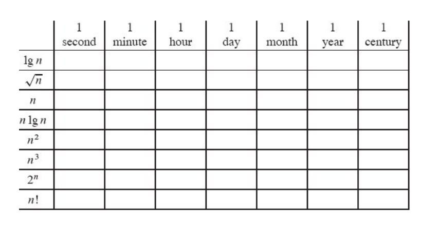

Para cada una de las siguientes funciones f(n) y tiempo t, determine el tamaño máximo de n, asumiendo que se pueden hacer 10^8 operaciones por segundo.

Soluciones:   
[Python](../tarea5.ipynb)  
[Papel](../Recursos/Tarea5_en_papel.pdf)